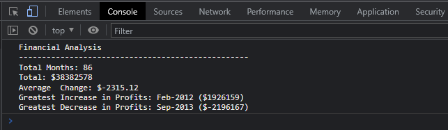

# Console-Finances

## Description

This repo is created for module 4 challenge, in this challenge I was using <b>JavaScript</b> and I was working with provided dataset.
I wrote JavaScript code that analyzes the records to calculate each of the following:
<ul>
<li>The total number of months included in the dataset.

<li>The net total amount of Profit/Losses over the entire period.

<li>The average of the changes in Profit/Losses over the entire period.

<li>The greatest increase in profits (date and amount) over the entire period.

<li>The greatest decrease in losses (date and amount) over the entire period.

<li>When I open my code in the browser my resulting analysis look like the following screenshot:
</ul>

## Repo url

https://github.com/MrJosu/Console-Finances

## Deployed repo url

https://mrjosu.github.io/Console-Finances/

## Instructions

To check console output I suggest You to use <b>Google Chrome</b> web browser as I wrote this instuction based on Google Chrome layout.
 Please open deployed repo url and press on your keyboard key combination: Ctrl + Shift + i to open Dev tools. 
 After select Console from top row to see output as on screenshot from description (you can use that screenshot to navigate)

## Installation

Not required

## Credits

N/A

## Tests

Tested in Google Chrome/Edge browsers dev tools console

## Licence

MIT License